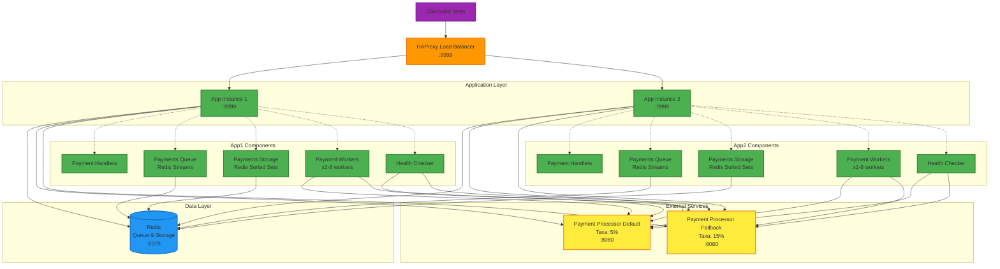

# Payments Proxy - Rinha de Backend 2025

Uma solução em Go para intermediar pagamentos entre múltiplos processadores de pagamento, desenvolvida para a Rinha de Backend 2025.

## Arquitetura



## Stack Tecnológica

- **Linguagem**: Go 1.24
- **Load Balancer**: HAProxy 3.1.7
- **Cache/Queue**: Redis 7.2
- **Containerização**: Docker & Docker Compose

## Endpoints

### Aplicação Principal

| Método | Endpoint | Descrição |
|--------|----------|-----------|
| `POST` | `/payments` | Processa um novo pagamento |
| `GET` | `/payments-summary` | Retorna resumo dos pagamentos processados |
| `GET` | `/health` | Health check da aplicação |

### Exemplo de Requisição

```bash
# Processar pagamento
curl -X POST http://localhost:9999/payments \
  -H "Content-Type: application/json" \
  -d '{
    "correlationId": "4a7901b8-7d26-4d9d-aa19-4dc1c7cf60b3",
    "amount": 19.90
  }'

# Consultar resumo
curl "http://localhost:9999/payments-summary?from=2025-01-01T00:00:00Z&to=2025-01-31T23:59:59Z"
```

## Como Executar

### 1. Clonar o Repositório
```bash
git clone https://github.com/vrtineu/payments-proxy.git
cd payments-proxy
```

### 2. Subir os Payment Processors
```bash
make start-gateways
```

### 3. Executar a Aplicação
```bash
# Desenvolvimento
make start

# "Produção" com Docker Compose
make compose
```

### 4. Executar Testes
```bash
make run-k6-tests
```

## Comandos Disponíveis

```bash
# Aplicação
make start              # Executa aplicação localmente
make build-prd          # Build para produção
make compose            # Sobe com Docker Compose
make compose-down       # Para containers

# Payment Gateways
make start-gateways     # Inicia gateways externos
make stop-gateways      # Para gateways
make down-gateways      # Remove gateways
make purge-gateways     # Limpa dados dos gateways

# Testes
make run-k6-tests       # Executa suite completa de testes
```

## Estratégia de Negócio

### Seleção de Gateway

1. **Verifica saúde** de ambos os gateways
2. **Prioriza gateway disponível** (Default primeiro)
3. **Escolhe por performance** quando ambos disponíveis (menor `minResponseTime`)
4. **Fallback automático** em caso de falha

### Processamento Assíncrono

1. **Requisições aceitas** imediatamente (HTTP 202)
2. **Enfileiramento** via Redis Streams
3. **Workers paralelos** processam fila
4. **Auto-claim** de mensagens orfãs
5. **Armazenamento** de resultados para auditoria

### Monitoramento de Saúde

- **Health checks** a cada 1 segundo
- **Rate limiting** respeitado (1 call / 5s por gateway)
- **Cache local** para reduzir latência
- **Distributed locking** via Redis para coordenação

## Resultados Esperados

- **Alta throughput**: Processamento de centenas de pagamentos/segundo
- **Baixa latência**: P99 < 10ms para máximo bônus
- **Zero inconsistências**: Auditoria rigorosa entre sistemas
- **Otimização de custos**: Maximização do uso do gateway com menor taxa

---

**Desenvolvido para a Rinha de Backend 2025** 🏆
